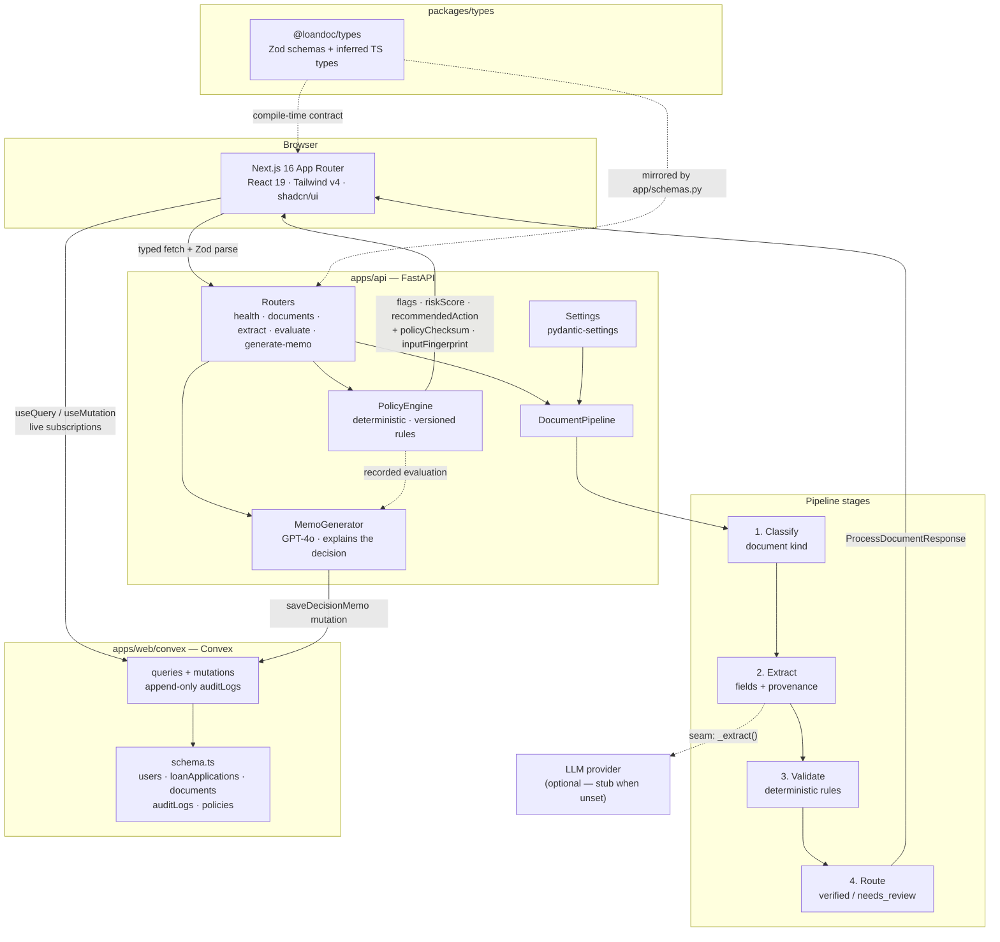

# LoanDoc AI

Agentic document processing for **banking loan underwriting**. An underwriter uploads the document
bundle for a loan application; an AI agent classifies each file, extracts the fields the credit
decision depends on, runs deterministic validation rules, and routes anything it is not confident
about to a human.

The design goal is the one that matters in regulated lending: **every number is traceable**. Each
extracted field carries a confidence score plus the page and bounding box it came from, so a
decision can always be explained after the fact.

---

## Architecture



### Request lifecycle

```mermaid
sequenceDiagram
    participant U as Underwriter
    participant W as Next.js (server component)
    participant A as FastAPI
    participant Pl as DocumentPipeline

    U->>W: Open dashboard
    W->>A: GET /api/v1/health
    A-->>W: { status, version, agentEnabled }
    Note over W: Health probe runs server-side;<br/>failure degrades to an "API offline" badge

    U->>A: POST /api/v1/documents?applicationId=…  (multipart)
    A->>A: Enforce MAX_UPLOAD_BYTES
    A->>Pl: process(document)
    Pl->>Pl: classify → extract → validate
    Pl-->>A: document + extraction
    A-->>U: 201 { document, extraction }
    Note over A: status = needs_review when any field<br/>falls below REVIEW_CONFIDENCE_THRESHOLD
```

---

## Repository layout

```
loandoc-ai/
├── apps/
│   ├── web/                 # Next.js (App Router, TS strict, Tailwind v4, shadcn/ui)
│   │   ├── convex/          # Convex schema, queries/mutations, seed script
│   │   ├── src/app/         # Routes + layout
│   │   ├── src/components/  # shadcn/ui primitives + ConvexProvider
│   │   ├── src/hooks/       # Typed useQuery/useMutation wrappers
│   │   └── src/lib/         # env parsing + typed API client
│   └── api/                 # FastAPI backend
│       ├── app/agents/      # LangChain extraction agent (extractor, pii, prompts)
│       ├── app/policy/      # Deterministic PolicyEngine + versioned rule registry
│       ├── app/memo/        # MemoGenerator (brief, prompts, Convex persistence)
│       ├── app/routers/     # HTTP layer only
│       ├── app/services/    # Pipeline logic (no framework imports)
│       ├── app/schemas.py   # Wire models, camelCase aliases
│       └── tests/           # Contract tests
├── packages/
│   └── types/               # @loandoc/types — shared Zod schemas
├── pnpm-workspace.yaml
└── package.json             # Root scripts
```

---

## Key design decisions

These are the points worth being able to defend in an interview.

| Decision | Why |
| --- | --- |
| **pnpm workspaces** over a single app | The frontend and the API must agree on one contract. A workspace package (`@loandoc/types`) makes that agreement a build-time dependency rather than a convention. |
| **Zod schemas, not bare TS types** | TypeScript types vanish at runtime. Every API response is `schema.parse`d, so a backend contract change fails loudly at the boundary instead of producing `undefined` deep in the React tree. |
| **Pydantic `alias_generator=to_camel`** | Python stays snake_case, JSON stays camelCase. Neither language adopts the other's naming convention, and the tests assert the JSON shape so drift is caught. |
| **Versioned `/api/v1` prefix from day one** | A v2 can be served alongside v1 instead of breaking deployed clients. |
| **`agentEnabled` capability flag** | Without an LLM key the API still serves a contract-correct response using a deterministic stub. The demo is deployable for free and the UI degrades honestly. |
| **Confidence threshold → `needs_review`** | In underwriting a silently wrong number costs far more than a slow one, so a single low-confidence field routes the whole document to a human. |
| **Provenance on every field** | Page + bounding box means any extracted value can be linked back to the pixels it came from — the audit trail a lender needs. |
| **Pipeline in `services/`, not in the router** | The pipeline has zero FastAPI imports, so it is unit-testable without HTTP and reusable from a worker/queue later. |
| **Table-driven extraction (`_EXPECTED_FIELDS`)** | Adding a document type is a data change, not a code change. |
| **One LLM call per PDF page, merged in Python** | A 40-page bank statement will not fit one prompt, and per-page calls mean a single bad page degrades one page instead of the document. Merging is deterministic code (highest confidence wins), so the result is reproducible and explainable rather than a second model's opinion. |
| **Every extracted field is optional in the LLM schema** | Forcing the model to emit a property value for a pay stub is how hallucinations get invited. "Absent" and "low confidence" are different signals and are treated differently. |
| **PII scanned before evidence is returned; snippets redacted** | The model happily quotes an SSN back inside its own evidence. Detection runs on the source text, findings carry only masked samples, and every returned snippet is redacted - so the audit trail cannot become the leak. |
| **Decisions are made by deterministic rules, never by the LLM** | The model's job ends at extraction. `PolicyEngine` has no clock, no randomness, no I/O and no floats, so same inputs + same policy version = byte-identical output. "Why was this declined?" is answered by reading code and a rule table, not by re-prompting a model. |
| **Policy versions are immutable and append-only** | Rules are `frozen=True` and a change means publishing a new `PolicyVersion`, so an evaluation recorded in January still replays under January's thresholds. Each result carries a SHA-256 `policyChecksum` (proves the rules were not edited) and an `inputFingerprint` (proves a replay is a replay). |
| **Rules compare *facts*, and facts are derived in one place** | `dti`, `ltv` and `incomeToLoanRatio` are computed in `policy/facts.py` with `Decimal`, so a rule stays a plain comparison publishable as data — and "how was DTI calculated?" has exactly one answer. A rule naming an unknown fact fails at import: a check that looks present and does nothing is the worst outcome available. |
| **Missing data is INFO, weighs 0, and still blocks AUTO_APPROVE** | Absent income is not zero income. An information gap must not read as evidence of risk, but it can never be auto-approved either. |
| **The memo is generated *from* a recorded decision, never instead of one** | Order is `extract (LLM) → evaluate (deterministic) → generate-memo (LLM)`. The memo explains a decision the rules engine already made, and prose that contradicts the recommended action is rejected with a `502` rather than stored — a memo reading "approval is recommended" over a `DECLINE` is worse than no memo. |
| **The model is handed a brief, not the raw payloads** | `memo/brief.py` renders every figure once, in banking conventions, and is declared as the only permitted source of numbers — so anything cited outside it is visibly invented. Figures that were not captured are stated as *not evidenced*: absence omitted is absence the model fills in. |
| **Tone is validated, not merely requested** | Prompt instructions are a request; `MemoSections` validators are a guarantee. Conversational filler ("Sure!", "let me know") fails validation, and asking for five named sections means the required structure is enforced by the parser instead of hoped for. |
| **Memo persistence runs through a Convex mutation** | The patch and its `DECISION_MEMO_GENERATED` audit entry commit in one Convex transaction, and the row stores `SEVERITY:RULE_ID` references rather than rendered messages so text can be re-rendered from the policy version without a migration. Convex returns `200` with `{"status":"error"}` for a failed mutation, which the client checks explicitly. |
| **`/api/v1/extract` returns 503 without a provider key** | The stub path exists for the demo pipeline; an extraction endpoint that fabricates fields would be worse than an honest outage. |
| **Convex for application state, FastAPI for document processing** | Convex gives the review queue live subscriptions with no polling or cache invalidation, which is what an underwriting dashboard needs; heavy/blocking extraction stays in Python where the ML tooling lives. |
| **Append-only `auditLogs` + `policyVersion` on every entry** | There is no update or delete mutation for audit rows, and each one records the policy version in force, so a past decision can be replayed exactly rather than reinterpreted under today's rules. |
| **Explicit `createdAt`/`updatedAt` despite Convex's `_creationTime`** | `updatedAt` has no built-in equivalent, and an audit trail should not depend on a system field whose semantics we do not control. |
| **In-memory document store** | Deliberate: the scaffold demonstrates the contract and pipeline without committing to a database. Swapping in SQLAlchemy replaces one dict behind three calls. |
| **Strict TS + extra flags** | `noUncheckedIndexedAccess`, `noUnusedLocals`, `exactOptionalPropertyTypes` catch the class of bugs plain `strict` misses. Ruff + `mypy --strict` are the Python equivalents. |

---

## Getting started

Prerequisites: **Node ≥ 20.11**, **pnpm 9**, **Python ≥ 3.10**.

### 1. Frontend + shared types

```bash
pnpm install
cp apps/web/.env.example apps/web/.env.local
pnpm --filter @loandoc/types build   # emits dist/ consumed by the web app
pnpm --filter web convex:dev         # provisions the Convex dev deployment, regenerates convex/_generated
pnpm --filter web convex:seed        # 5 synthetic loan applications (faker, fixed seed)
pnpm dev                             # http://localhost:3000
```

### 2. Backend

```bash
cd apps/api
python3 -m venv .venv && source .venv/bin/activate
pip install -e ".[dev]"
cp .env.example .env
uvicorn app.main:app --reload --port 8000   # http://localhost:8000/docs
```

---

## Scripts

| Command | Description |
| --- | --- |
| `pnpm dev` | Next.js dev server |
| `pnpm build` | Build `@loandoc/types`, then the web app |
| `pnpm lint` | ESLint across every workspace package |
| `pnpm typecheck` | `tsc --noEmit` across every workspace package |
| `pnpm format` / `pnpm format:check` | Prettier (with the Tailwind class-sorting plugin) |
| `pnpm api:dev` | Uvicorn with reload (expects the venv to be active) |
| `pytest` (in `apps/api`) | Backend contract tests |
| `ruff check . && mypy app` (in `apps/api`) | Python lint + strict type check |

---

## Environment variables

Templates are committed as `.env.example`; the real files are git-ignored.

**`apps/web/.env.example`** — only `NEXT_PUBLIC_*` values, because Next.js inlines them into the
client bundle. Never put a secret here.

| Variable | Purpose |
| --- | --- |
| `NEXT_PUBLIC_API_BASE_URL` | Base URL of the FastAPI backend |
| `NEXT_PUBLIC_APP_NAME` | Display name in the header and page metadata |

**`apps/api/.env.example`**

| Variable | Purpose |
| --- | --- |
| `API_ENV`, `API_VERSION` | Environment name and reported version |
| `CORS_ORIGINS` | Comma-separated allowed browser origins (never `*`) |
| `OPENAI_API_KEY`, `OPENAI_MODEL` | Provider credentials; empty key ⇒ stub mode (and `/extract` returns 503) |
| `OPENAI_TIMEOUT_SECONDS`, `OPENAI_MAX_RETRIES` | Per-page provider call budget |
| `EXTRACTION_PAGE_CONCURRENCY` | Parallel per-page LLM calls |
| `EXTRACTION_MAX_PAGES` | Page ceiling, checked before any tokens are spent |
| `REVIEW_CONFIDENCE_THRESHOLD` | Below this, a field is routed to human review |
| `MAX_UPLOAD_BYTES` | Upload size limit enforced before any processing |

---

## API surface

| Method | Path | Description |
| --- | --- | --- |
| `GET` | `/api/v1/health` | Liveness + capability discovery (`agentEnabled`) |
| `GET` | `/api/v1/documents?applicationId=…` | List documents for an application |
| `POST` | `/api/v1/documents?applicationId=…` | Upload a document and run the pipeline |
| `GET` | `/api/v1/documents/{id}` | Fetch a single document |
| `POST` | `/api/v1/extract` | Multipart PDF upload → LLM field extraction with per-field confidence and evidence |
| `POST` | `/api/v1/evaluate` | Deterministic policy evaluation → flags, risk score, recommended action |
| `GET` | `/api/v1/policies` | Published policy versions and their rules |
| `POST` | `/api/v1/generate-memo` | GPT-4o underwriting memo from extraction + evaluation, persisted to Convex |

Interactive OpenAPI docs: <http://localhost:8000/docs>.

### Extraction agent

```bash
curl -F file=@w2.pdf -F applicationId=app_123 http://localhost:8000/api/v1/extract
```

```jsonc
{
  "documentType": "W2",              // confidence-weighted vote across pages
  "documentTypeConfidence": 0.94,
  "pageCount": 3,
  "annualIncome": {
    "value": "102000",
    "confidence": 0.95,
    "page": 2,
    "rawText": "Annual income 102,000.00"   // evidence, PII-redacted
  },
  "piiFindings": [{ "kind": "ssn", "page": 1, "occurrences": 1, "maskedSample": "*****6789" }],
  "privacyNotice": "Sensitive data detected (ssn) on page(s) 1. …",
  "pages": [{ "page": 1, "status": "extracted", "detectedType": "W2" }],
  "warnings": []
}
```

### Underwriting memo

```bash
curl -X POST localhost:8000/api/v1/generate-memo -H 'content-type: application/json' -d '{
  "applicationId": "<convex id>",
  "extractedData": { "annualIncome": "180000", "monthlyDebtPayments": "2000",
                     "creditScore": 760, "employmentStatus": "fullTime" },
  "loanRequest": { "loanAmount": "50000", "propertyValue": "400000" },
  "policyEvaluation": { /* the response from /api/v1/evaluate, unmodified */ }
}'
```

Returns the five required sections (Executive Summary, Financial Profile, Risk Factors,
Recommendation, Conditions) plus a `markdown` rendering, the policy version/checksum the
memo describes, and `persisted`. `POST` it the evaluation you actually recorded — it is not
recomputed, so the memo provably describes the decision that was taken.

Status codes: `503` no `OPENAI_API_KEY` (set `allowTemplateFallback: true` to opt into a
deterministic, self-declaring template instead), `502` model output failed the tone or
consistency contract, `422` malformed input. A Convex write failure is a warning on a `200`,
not a lost memo.

### Policy engine and audit trail

```bash
curl -X POST localhost:8000/api/v1/evaluate -H 'content-type: application/json' -d '{
  "extractedData": { "annualIncome": "60000", "monthlyDebtPayments": "2500",
                     "creditScore": 590, "employmentStatus": "selfEmployed" },
  "loanRequest": { "loanAmount": "390000", "propertyValue": "400000" }
}'
```

```jsonc
{
  "passed": false,
  "overallRiskScore": 100,             // severity-weighted, clamped
  "recommendedAction": "DECLINE",      // any CRITICAL -> DECLINE
  "flags": [{ "ruleId": "DTI_LIMIT", "severity": "CRITICAL", "observedValue": "50.0%",
              "threshold": "43.0%", "operator": "GT",
              "message": "Debt-to-income ratio 50.0% exceeds the 43.0% limit." }],
  "facts": { "dti": "50.0%", "ltv": "97.5%", "incomeToLoanRatio": "0.15" },
  "missingFacts": [],
  "policyVersion": "2025.07.1",
  "policyChecksum": "…",               // SHA-256 of the rule set
  "inputFingerprint": "…"              // SHA-256 of the inputs
}
```

Active rules (`2025.07.1`):

| Rule | Condition | Severity |
| --- | --- | --- |
| `DTI_LIMIT` | `dti > 43%` | CRITICAL |
| `CREDIT_SCORE_FLOOR` | `creditScore < 620` | CRITICAL |
| `INCOME_COVERAGE` | `incomeToLoanRatio < 3` | WARNING |
| `EMPLOYMENT_STABILITY` | `employmentStatus` does not contain "full" | WARNING |
| `HIGH_LTV` | `ltv > 90%` | WARNING |

Replaying a historical decision is the same request with `"policyVersion": "2025.01.0"`
pinned — that policy's 50% DTI ceiling still applies, and its different
`policyChecksum` proves which rule set was in force. `GET /api/v1/policies` lists every
published version with its rules and rationales. An unknown version is a `422`, never a
silent fallback to the active policy.

Status codes: `415` non-PDF, `422` corrupt / encrypted / no text layer (needs OCR),
`413` too large, `503` provider unavailable or unconfigured. A page that fails at the
provider appears in `pages` with `status: "failed"` and does not fail the request;
if *every* page fails, the request becomes a 503 rather than a hollow success.

---

## Roadmap

The seams left intentionally open, in the order they'd be closed:

1. Replace `DocumentPipeline._extract` with a real vision-model call returning bounding boxes.
2. Persist documents (Postgres + SQLAlchemy + Alembic) and move processing onto a queue.
3. Object storage for uploads plus virus scanning at ingest.
4. Review UI: side-by-side document viewer with clickable field provenance.
5. AuthN/AuthZ and an append-only audit log of every human override.
