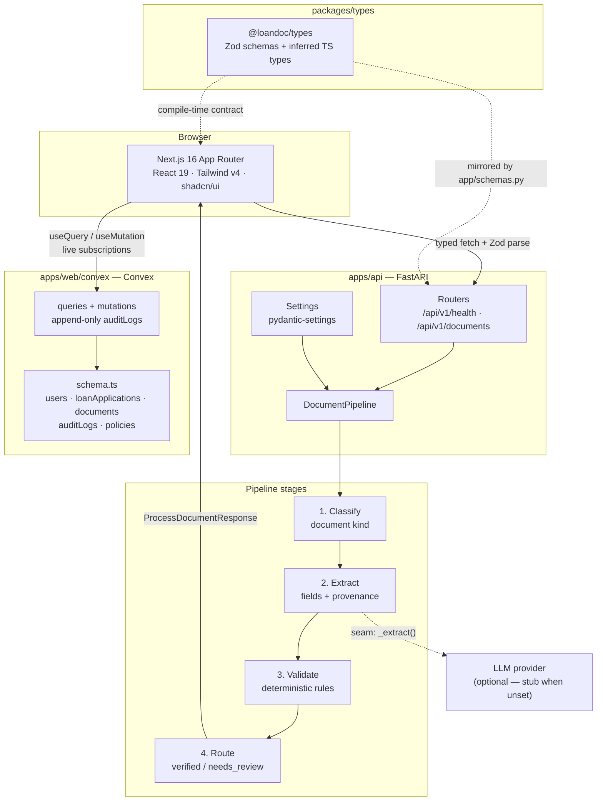

# LoanDoc AI

Agentic document processing for **banking loan underwriting**. An underwriter uploads the document
bundle for a loan application; an AI agent classifies each file, extracts the fields the credit
decision depends on, runs deterministic validation rules, and routes anything it is not confident
about to a human.

The design goal is the one that matters in regulated lending: **every number is traceable**. Each
extracted field carries a confidence score plus the page and bounding box it came from, so a
decision can always be explained after the fact.

---

## Architecture



### Request lifecycle

```mermaid
sequenceDiagram
    participant U as Underwriter
    participant W as Next.js (server component)
    participant A as FastAPI
    participant Pl as DocumentPipeline

    U->>W: Open dashboard
    W->>A: GET /api/v1/health
    A-->>W: { status, version, agentEnabled }
    Note over W: Health probe runs server-side;<br/>failure degrades to an "API offline" badge

    U->>A: POST /api/v1/documents?applicationId=…  (multipart)
    A->>A: Enforce MAX_UPLOAD_BYTES
    A->>Pl: process(document)
    Pl->>Pl: classify → extract → validate
    Pl-->>A: document + extraction
    A-->>U: 201 { document, extraction }
    Note over A: status = needs_review when any field<br/>falls below REVIEW_CONFIDENCE_THRESHOLD
```

---

## Repository layout

```
loandoc-ai/
├── apps/
│   ├── web/                 # Next.js (App Router, TS strict, Tailwind v4, shadcn/ui)
│   │   ├── convex/          # Convex schema, queries/mutations, seed script
│   │   ├── src/app/         # Routes + layout
│   │   ├── src/components/  # shadcn/ui primitives + ConvexProvider
│   │   ├── src/hooks/       # Typed useQuery/useMutation wrappers
│   │   └── src/lib/         # env parsing + typed API client
│   └── api/                 # FastAPI backend
│       ├── app/routers/     # HTTP layer only
│       ├── app/services/    # Pipeline logic (no framework imports)
│       ├── app/schemas.py   # Wire models, camelCase aliases
│       └── tests/           # Contract tests
├── packages/
│   └── types/               # @loandoc/types — shared Zod schemas
├── pnpm-workspace.yaml
└── package.json             # Root scripts
```

---

## Key design decisions

These are the points worth being able to defend in an interview.

| Decision | Why |
| --- | --- |
| **pnpm workspaces** over a single app | The frontend and the API must agree on one contract. A workspace package (`@loandoc/types`) makes that agreement a build-time dependency rather than a convention. |
| **Zod schemas, not bare TS types** | TypeScript types vanish at runtime. Every API response is `schema.parse`d, so a backend contract change fails loudly at the boundary instead of producing `undefined` deep in the React tree. |
| **Pydantic `alias_generator=to_camel`** | Python stays snake_case, JSON stays camelCase. Neither language adopts the other's naming convention, and the tests assert the JSON shape so drift is caught. |
| **Versioned `/api/v1` prefix from day one** | A v2 can be served alongside v1 instead of breaking deployed clients. |
| **`agentEnabled` capability flag** | Without an LLM key the API still serves a contract-correct response using a deterministic stub. The demo is deployable for free and the UI degrades honestly. |
| **Confidence threshold → `needs_review`** | In underwriting a silently wrong number costs far more than a slow one, so a single low-confidence field routes the whole document to a human. |
| **Provenance on every field** | Page + bounding box means any extracted value can be linked back to the pixels it came from — the audit trail a lender needs. |
| **Pipeline in `services/`, not in the router** | The pipeline has zero FastAPI imports, so it is unit-testable without HTTP and reusable from a worker/queue later. |
| **Table-driven extraction (`_EXPECTED_FIELDS`)** | Adding a document type is a data change, not a code change. |
| **Convex for application state, FastAPI for document processing** | Convex gives the review queue live subscriptions with no polling or cache invalidation, which is what an underwriting dashboard needs; heavy/blocking extraction stays in Python where the ML tooling lives. |
| **Append-only `auditLogs` + `policyVersion` on every entry** | There is no update or delete mutation for audit rows, and each one records the policy version in force, so a past decision can be replayed exactly rather than reinterpreted under today's rules. |
| **Explicit `createdAt`/`updatedAt` despite Convex's `_creationTime`** | `updatedAt` has no built-in equivalent, and an audit trail should not depend on a system field whose semantics we do not control. |
| **In-memory document store** | Deliberate: the scaffold demonstrates the contract and pipeline without committing to a database. Swapping in SQLAlchemy replaces one dict behind three calls. |
| **Strict TS + extra flags** | `noUncheckedIndexedAccess`, `noUnusedLocals`, `exactOptionalPropertyTypes` catch the class of bugs plain `strict` misses. Ruff + `mypy --strict` are the Python equivalents. |

---

## Getting started

Prerequisites: **Node ≥ 20.11**, **pnpm 9**, **Python ≥ 3.10**.

### 1. Frontend + shared types

```bash
pnpm install
cp apps/web/.env.example apps/web/.env.local
pnpm --filter @loandoc/types build   # emits dist/ consumed by the web app
pnpm --filter web convex:dev         # provisions the Convex dev deployment, regenerates convex/_generated
pnpm --filter web convex:seed        # 5 synthetic loan applications (faker, fixed seed)
pnpm dev                             # http://localhost:3000
```

### 2. Backend

```bash
cd apps/api
python3 -m venv .venv && source .venv/bin/activate
pip install -e ".[dev]"
cp .env.example .env
uvicorn app.main:app --reload --port 8000   # http://localhost:8000/docs
```

---

## Scripts

| Command | Description |
| --- | --- |
| `pnpm dev` | Next.js dev server |
| `pnpm build` | Build `@loandoc/types`, then the web app |
| `pnpm lint` | ESLint across every workspace package |
| `pnpm typecheck` | `tsc --noEmit` across every workspace package |
| `pnpm format` / `pnpm format:check` | Prettier (with the Tailwind class-sorting plugin) |
| `pnpm api:dev` | Uvicorn with reload (expects the venv to be active) |
| `pytest` (in `apps/api`) | Backend contract tests |
| `ruff check . && mypy app` (in `apps/api`) | Python lint + strict type check |

---

## Environment variables

Templates are committed as `.env.example`; the real files are git-ignored.

**`apps/web/.env.example`** — only `NEXT_PUBLIC_*` values, because Next.js inlines them into the
client bundle. Never put a secret here.

| Variable | Purpose |
| --- | --- |
| `NEXT_PUBLIC_API_BASE_URL` | Base URL of the FastAPI backend |
| `NEXT_PUBLIC_APP_NAME` | Display name in the header and page metadata |

**`apps/api/.env.example`**

| Variable | Purpose |
| --- | --- |
| `API_ENV`, `API_VERSION` | Environment name and reported version |
| `CORS_ORIGINS` | Comma-separated allowed browser origins (never `*`) |
| `OPENAI_API_KEY`, `OPENAI_MODEL` | Provider credentials; empty key ⇒ stub mode |
| `REVIEW_CONFIDENCE_THRESHOLD` | Below this, a field is routed to human review |
| `MAX_UPLOAD_BYTES` | Upload size limit enforced before any processing |

---

## API surface

| Method | Path | Description |
| --- | --- | --- |
| `GET` | `/api/v1/health` | Liveness + capability discovery (`agentEnabled`) |
| `GET` | `/api/v1/documents?applicationId=…` | List documents for an application |
| `POST` | `/api/v1/documents?applicationId=…` | Upload a document and run the pipeline |
| `GET` | `/api/v1/documents/{id}` | Fetch a single document |

Interactive OpenAPI docs: <http://localhost:8000/docs>.

---

## Roadmap

The seams left intentionally open, in the order they'd be closed:

1. Replace `DocumentPipeline._extract` with a real vision-model call returning bounding boxes.
2. Persist documents (Postgres + SQLAlchemy + Alembic) and move processing onto a queue.
3. Object storage for uploads plus virus scanning at ingest.
4. Review UI: side-by-side document viewer with clickable field provenance.
5. AuthN/AuthZ and an append-only audit log of every human override.
